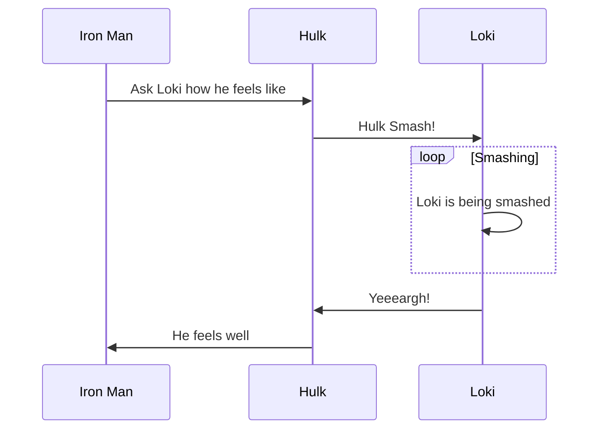
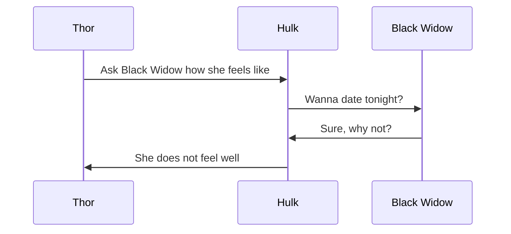

# Replay Driver

Replay driver allows you to read the messages from a [recorded session](/reactor_system.md#Session-Recording)
saved with the [chronicle queue](/channel_drivers/cq/cq_main.md) [local driver](/channel_drivers/README.md) and to feed with them your [reactor system](/reactor_system.md).

## Replay driver replay semantic

The word choice of the previous section has not been casual: ***replay driver* is about re-delivering the messages that were 
recorded during a session recorded execution, is *not* about providing the same input and checking if the same output 
is obtained.**. The only messages that are going to be delivered within a replayed session with the default *replay driver* 
are the ones that were recorded and executed. What *replay driver* does is delivering messages in an appropriate order to actors living 
within the reactor system. As described in the [replay section](/replaying.md), it does not create reactors or reset 
the state of the system, it feeds messages to your application logic and prevents from delivering un-recorded messages. 
A realtime diff during replay is envisioned, but not yet implemented.  

## How it works

ReActed by design is a highly concurrent system with the meaning that every reactor has it own execution flow and all of them
advance all together. There isn't a clearly defined total ordering of the executions within a reactor system: if you
think about the dispatchers that can be multiple and multi threaded a direct consequence is that some actions can actually take place
at the *same* time. Other than that, without some centralized and sequential control of the executed actions it would
not possible defining an exact and correct execution total order.

!> For this reason, *replay driver* does not embrace total ordering but a **causal** ordering.
ReActed *replay driver* guarantees that a message is not going to be *replayed* before its place in the cause-effect
**flow of the original execution** and is going to be replayed in the exact execution order of the reactor that receives it.
**The replay is going to be *consistent* per flow basis and *exact* per reactor basis.**

Execution flows that are not entwined might receive messages in a different **total** order from the original session,
but the replayed execution order is always going to be consistent per flow and exact per reactor.

### Example

Let's see a quick example of the above rules. Let's say that we recorded an execution with 6 reactors. Since we are
brave enough and we do not fear © infrigiments lawsuits, let's call them with the name of some Åvengers.

In the first flow, Iron Man sends a message to Hulk, THEN Hulk sends a message to the poor Loki.



In the second flow, Thor sends a message to Hulk, THEN Hulk sends a message to Black Widow.



The above two flows are not dependent on each other. This means that in [session recording](/reactor_system.md#Session-Recording) the messages
of the two flows could have been registered interleaving one flow with the other. What is guaranteed is that any `ReActor`, let's say *Hulk* will
always be replayed using the exact order of the messages that were **executed and not sent** during the recording phase.

Long story short: due to the concurrency, the recorded send order is not totally but just causally guaranteed, but the
execution order is per reactor guaranteed.

!>NOTE: *Replay Driver* is about delivery messages in the execution order found from the recorded session, it has no
notion of delays. This means that while replaying a session, a `ReActor` might receive a response for something that
is still being computed. This does not violate the causality, because in replayed sessions no output is actually delivered,
so from the `ReActor` perspective everything is consistent. In the Loki-smashing example, this means that while replaying
a session, Iron Man could receive a reply from Hulk while **Loki `ReActor`** is still performing the smashing loop.
Is it a problem? Not as long `ReActors` talk to each other using messages, because the total ordering is controlled and
guaranteed by the recorded session and by the replay driver

## Naming

*Replay driver* behavior is about delivering messages in an appropriate order to reactors that are waiting for them.
This means that it must be able to find the exact destination of a message within the [local reactor system](/reactor_system.md).

In the [reactors section](/reactor.md) we learnt that a *spawned reactor* is uniquely targettable within a cluster
through the location agnostic `ReActorRef`. One of the requirements for *spawning* a reactor, is providing a *reactor name*.

*Replay driver* is the reason behind the advice of not choosing randomly generated reactor names: reactors with a randomly
generated name have a different `ReActorRef` every time they are spawned, and in such a case the *replay driver* would not
know where to send the messages from the log. The destination would not match.

## Replaying in practice

In the [examples](https://github.com/reacted-io/reacted/tree/master/examples/src/main/java/io/reacted/examples/webappbackend)
package is available a small example that shows how to build a system replaying-prone even if it depends on highly dynamic
information such as web clients or external databases. The core concept is the use of the [reactor factory](/patterns.md#ReActor-Factory) 
pattern to overcome the [serialization constraint for messages](/messaging.md) and the lack of non-replayable interaction
with the system to replicate clients' requests. Replicating the database interaction luckily is much easier, it's all
about bridling the response coming from the database into a message.

```java
        @Override
        public void onNext(Document item) {
            requester.tell(mongoGate, new StorageMessages.QueryReply(item.get(DatabaseService.PAYLOAD_FIELD)
                                                                         .toString()))
                     .thenAccept(delivery -> subscription.request(1));
        }
```

In the above snippet we see how to do this: the [MongoDB driver used in the example](http://mongodb.github.io/mongo-java-driver/) returns
a publisher to which we should subscribe in order to asynchronously read the replies from the database. All we need to do
once we receive a reply, is *telling* the response towards the requester. While replaying a session, of course there will be
no database, but what was returned from it in the original session will be within those messages. Database output consumer
won't even notice the difference from being live and being replayed. 